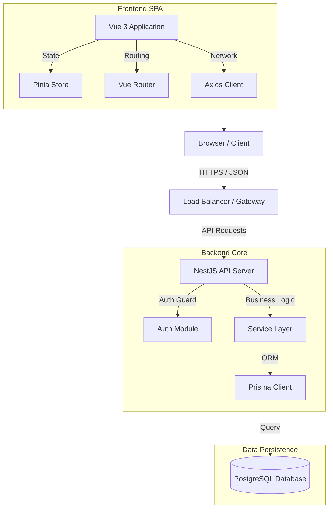

# LanceKit SaaS ⚡


> **Exquisite Freelance Management.**  
> Effortlessly manage clients, track revenue, and generate professional invoices with a CRM built for modern freelancers.

---

## 💎 Project Overview

**LanceKit SaaS** is a high-performance, full-stack CRM solution designed to streamline the administrative chaos of freelance work. Built with a focus on **speed**, **security**, and **user experience**, it offers a cohesive suite of tools to handle everything from client acquisition to final billing.

Distinctive features include a **Smart Invoice Builder**, **Real-time Revenue Analytics**, and a **Print-Isolated** invoice rendering engine for pixel-perfect PDFs.

## 🏗 Architecture

The system employs a decoupled, service-oriented architecture ensuring scalability and separation of concerns.



## ✨ Key Features

### 🚀 Dashboard & Analytics
- **Real-time Metrics**: Track total revenue, pending invoices, and active clients at a glance.
- **Interactive Charts**: Visual breakdown of income sources (future roadmap).
- **Activity Feed**: Live updates on recent invoice generation and status changes.

### 🧾 Intelligent Invoicing
- **Drag-and-Drop Builder**: (Concept) Intuitive invoice creation flow.
- **Print Isolation Engine**: A proprietary CSS engine that ensures invoices print perfectly by strictly isolating content from the UI chrome.
- **Status Tracking**: Monitor lifecycle from `DRAFT` → `PENDING` → `PAID`.

### 👥 Client Relationship Management
- **Unified Profiles**: Centralized repository for client contact info and billing history.
- **Quick-Search**: Instant filtering by name, company, or email.
- **Smart Actions**: One-click invoice generation for specific clients.

### 🔒 Enterprise-Grade Security
- **JWT Authentication**: Stateless, secure token-based user sessions.
- **Data Isolation**: Strict row-level security ensuring users only access their own data.
- **Validation**: Rigorous Zod/Class-Validator pipelines for data integrity.

---

## � Technology Stack

| Layer | Technology | Key Libraries |
|-------|------------|---------------|
| **Frontend** | Vue 3 (Composition API) | Vite, Pinia, Vue Router, TailwindCSS |
| **Backend** | NestJS (Node.js) | Passport, Class-Validator, RxJS |
| **Database** | PostgreSQL | Prisma ORM |
| **DevOps** | Docker (Ready) | ESLint, Prettier, Swagger |

---

## ⚡ Getting Started

### Prerequisites
- Node.js v18+
- PostgreSQL v14+

### 1. Backend Setup
Initialize the API server and database connection.

```bash
cd backend
npm install
# Configure .env with your DATABASE_URL
npx prisma migrate dev --name init
npm run start:dev
```
*Server runs on `http://localhost:3000`*

### 2. Frontend Setup
Launch the reactive user interface.

```bash
cd frontend
npm install
npm run dev
```
*App runs on `http://localhost:5173`*

---

## 📚 Documentation & API

Comprehensive API documentation is auto-generated via simple Swagger integration.
- **Swagger UI**: Visit `http://localhost:3000/api/docs` while the backend is running.

## 🤝 License

Distributed under the MIT License. See `LICENSE` for more information.

---
*Crafted with ❤️ by the LanceKit Team.*
